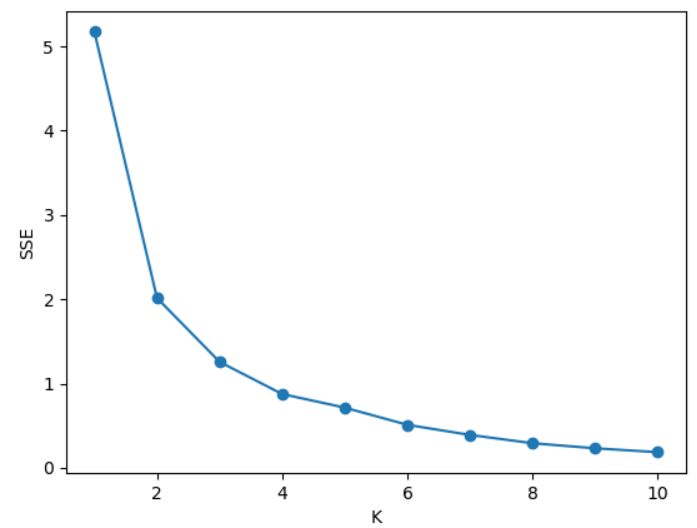
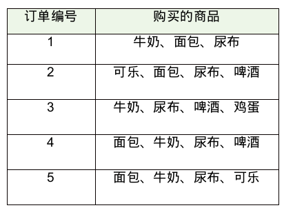

3-Association Rule Learning

# K-Means 讨论
## K-Means 手肘法
统计不同 k 取值的误差平方和
```
sse = []
for k in range(1, 11):
	# kmeans算法
	kmeans = KMeans(n_clusters=k)
	kmeans.fit(train_x)
	# 计算inertia簇内误差平方和
	sse.append(kmeans.inertia_)
x = range(1, 11)
plt.xlabel('K')
plt.ylabel('SSE')
plt.plot(x, sse, 'o-')
plt.show()
```



计算簇内误差平方和并画出手肘图，在图像中选择拐点作为最优 k 值．手肘图有两部分组成，左侧指数衰减区和右侧线性衰减区．我们选择＂手肘点＂作为最优 k 值点．在手肘点右侧 SSE 线性减小，增加 k 的收益有限．

## K-Means 在图像分割中的应用
```
# 用K-Means对图像进行2聚类
kmeans = KMeans(n_clusters=2)
kmeans.fit(img)
label = kmeans.predict(img)
# 将图像聚类结果，转化成图像尺寸的矩阵
label = label.reshape([width, height])
# 创建个新图像pic_mark，用来保存图像聚类的结果，并设置不同的灰度值
pic_mark = image.new("L", (width, height))
for x in range(width):
    for y in range(height):
        # 根据类别设置图像灰度, 类别0 灰度值为255， 类别1 灰度值为127
        pic_mark.putpixel((x, y), int(256/(label[x][y]+1))-1)
```


K-Means图像分割的不足：　按照图像的灰度值定义距离，对图像的文理，内容缺乏理解．

采用深度学习模型：100层 Tiramisu进行图像分割（全卷积 DenseNets)

[实例网站](remove.bg)

# 推荐系统中的常用算法
- 基于内容推荐 (L2)
- 基于协同过滤推荐 (L2)
- 基于关联规则推荐 (L3)
- 基于效用推荐
- 基于知识推荐
- 组合推荐

# 基于关联规则推荐

## 引例
- 啤酒和尿布在沃尔玛经常被同时购买，因此沃尔玛将这两件商品放在了一起．
- 美国明尼苏达州一家Target被客户投诉，一位中年男子指控Target将婴儿产品优惠券寄给他的女儿（高中生）。但没多久他却来电道歉，因为女儿经他逼问后坦承自己真的怀孕了。

## 关联规则与相关概念

### 关联规则学习 Association Rule Learning
Association rule learning is a rule-based machine learning method for discovering interesting relations between variables in large databases. It is intended to identify strong rules discovered in databases using some measures of interestingness.

In addition to the market basket analysis association rules are employed today in many application areas including Web usage mining, intrusion detection, continuous production, and bioinformatics. In contrast with sequence mining, association rule learning typically does not consider the order of items either within a transaction or across transactions.

### 支持度 (Support)
Support is an indication of how frequently the itemset appears in the dataset.

The support of $X$ with respect to $T$ is definied as the proportion of transcations $t$ in the dataset which contains the itemset $X$.


#### 例子


- supp{牛奶} = 4/5 = 0.8
- supp{牛奶，面包} = 3/5 = 0.6
- 
### 置信度 (Confidence)
Confidence is an indication of how often the rule has been found to be true.

The confidence value of a rule,  $X\Rightarrow Y$ , with respect to a set of transactions $T$, is the proportion of the transactions that contains $X$ which also contains $Y$.

Confidence is defined as:


### 提升度 (Lift)
